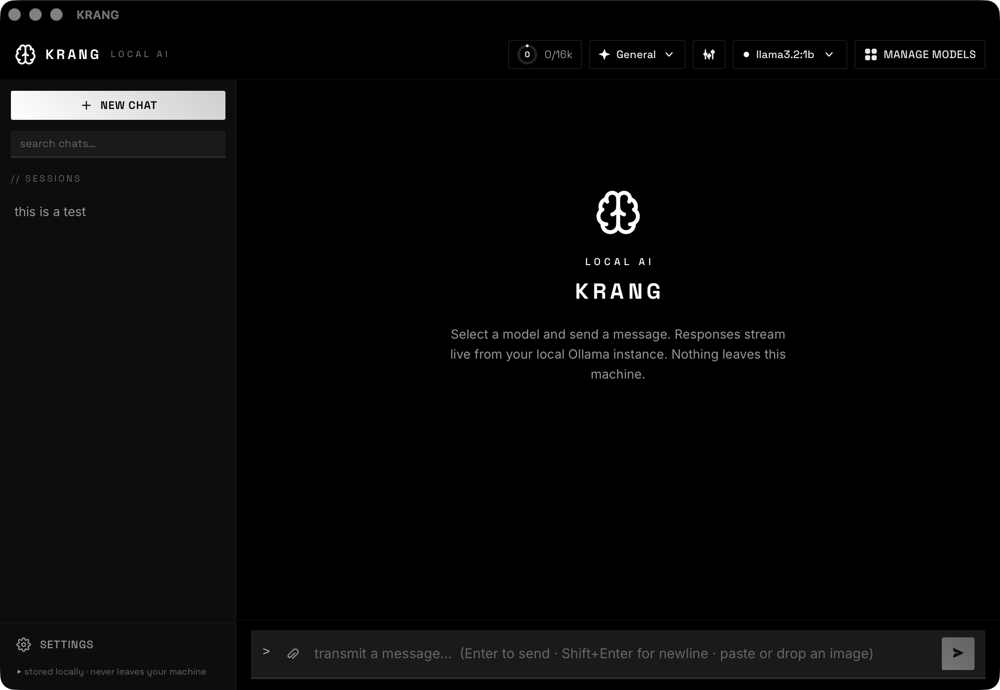

# KRANG · Local AI

A React app for chatting with local models via [Ollama](https://ollama.com). No backend,
no accounts, no telemetry: it talks **directly** to the Ollama API at
`http://localhost:11434`, and every message, model, and conversation stays on your machine.

Industrial "Kinetic Archive" design (Space Grotesk + Inter, sharp edges, precise red accent)
with switchable themes including light mode.



It runs two ways from the same codebase:

- **Mac app (DMG):** a native desktop app that sets Ollama up for you on first launch.
- **Web service:** clone and run with one script on Linux, macOS, or anything else.

## Which mode should I use?

| You are on | Use | Why |
| --- | --- | --- |
| **a Mac, want a normal app** | Section A (DMG) | Double-click app, auto-manages Ollama, no terminal |
| **Linux, or want to hack on it** | Section B (web service) | One script, runs in your browser, hot reload available |

---

## Section A: Mac app (DMG)

A native macOS desktop app (Apple Silicon). On first launch it makes sure Ollama is ready:
it uses your existing Ollama if you have one, otherwise it downloads and installs Ollama into
the app's own folder and starts it. It shares your existing `~/.ollama` models, so nothing is
re-downloaded.

### Build the DMG

There is no prebuilt download yet, so build it once locally:

```bash
./scripts/build-mac.sh
```

Prerequisites the script checks for:
- **Rust:** `curl --proto '=https' --tlsv1.2 -sSf https://sh.rustup.rs | sh`
- **Xcode Command Line Tools:** `xcode-select --install`

The unsigned build lands at:

```
src-tauri/target/aarch64-apple-darwin/release/bundle/dmg/KRANG_1.0.0_aarch64.dmg
```

### Install and launch

1. Open the `.dmg` and drag **KRANG** into your **Applications** folder.
2. The app is **unsigned** (no paid Apple Developer ID), so the first time you open it macOS
   will say it is from an unidentified developer. To get past this one time:
   **right-click the app, choose Open, then click Open in the dialog.** After that it opens
   normally with a double-click.
3. On first launch KRANG checks for Ollama and sets it up automatically, showing progress.
   When it says Ready, start chatting.

> The app only ever talks to Ollama on `localhost:11434`. When it quits, it stops only an
> Ollama process it started itself; a pre-existing Ollama keeps running.

---

## Section B: Web service (Linux / macOS / other)

One command installs prerequisites, starts Ollama, and launches the app in your browser:

```bash
./start.sh
```

On **macOS** it uses [Homebrew](https://brew.sh); on **Linux** it uses your distro's package
manager plus Ollama's official installer. The script is safe to re-run: it installs only
what is missing, starts Ollama only if it is not already running, offers to pull a default
model on first launch, and opens the app at http://localhost:5173. Press **Ctrl+C** to stop
both the web app and the Ollama process it started.

For hacking on the UI with hot reload, run the Vite dev server instead of a production build:

```bash
./start.sh --dev
```

### Manual setup

If you would rather do it by hand:

1. **Install Node.js 18+.**
   - macOS: `brew install node`
   - Linux (Debian/Ubuntu): `curl -fsSL https://deb.nodesource.com/setup_lts.x | sudo -E bash - && sudo apt-get install -y nodejs`
   - Or download from [nodejs.org](https://nodejs.org).
2. **Install Ollama.**
   - macOS: `brew install ollama` (or download from [ollama.com/download](https://ollama.com/download))
   - Linux: `curl -fsSL https://ollama.com/install.sh | sh`
3. **Start the Ollama service:**
   ```bash
   ollama serve
   ```
4. **Pull at least one model** (or use the in-app model browser):
   ```bash
   ollama pull llama3.2      # or gemma3, qwen2.5-coder, deepseek-r1, etc.
   ```
5. **Install dependencies and run:**
   ```bash
   npm install
   npm run dev      # http://localhost:5173
   ```

> **CORS note (web mode only):** browsers block cross-origin requests by default. Ollama
> allows `localhost` origins out of the box, but if you see CORS errors, start Ollama with
> `OLLAMA_ORIGINS=* ollama serve`. The Mac app avoids this entirely by routing requests
> through its Rust layer.

---

## Features

### Chat
- **Streaming responses:** `POST /api/chat` with `stream: true`, a typing indicator,
  auto-scroll, and a **Stop** button to cancel generation mid-stream.
- **Markdown + code:** assistant replies render as markdown with syntax-highlighted code
  blocks, language labels, and a copy button on each block.
- **Math rendering:** LaTeX (`$...$` inline, `$$...$$` block) is typeset with KaTeX.
- **Live stats:** tokens/sec and time-to-first-token are shown under each reply.
- **Input:** auto-growing textarea; Enter to send, Shift+Enter for a newline; image attach
  for vision models.

### Models
- **Model selector:** lists every installed model (`GET /api/tags`) with a short,
  human-readable description.
- **Model browser:** a curated catalog of ~30 popular models across General / Reasoning /
  Coding / Vision / Compact, with one-click install that streams `ollama pull` progress,
  cancel, installed badges, and an info panel (publisher, parameters, context, license, plus
  live specs from `/api/show` for installed models).
- **Model-switch dividers:** changing the model mid-chat drops a marker in the log.

### Skills (personas)
Preset system prompts (Code Reviewer, Tutor, Project Planner, and more) that load a role with
one click, plus your own custom skills saved locally.

### Context window & compaction
- **Context gauge:** a ring shows how full the model's context window is, self-calibrated
  against Ollama's exact token counts after each turn.
- **Window control:** pick the `num_ctx` sent to Ollama (capped at the model's max).
- **Compaction:** summarize older messages to free up context, manually or automatically.

### History & data
- **Chat history:** conversations persisted to `localStorage`, auto-titled, with per-chat
  delete and full-text search.
- **Settings:** Appearance (themes), Data (export all to JSON, clear), and About.

### Themes
Six built-in themes, switchable at runtime:

| Theme      | Type  | Accent                    |
|------------|-------|---------------------------|
| Mono Dark  | Dark  | White on black (default)  |
| Mono Light | Light | Black on white            |
| Krang      | Dark  | Industrial red            |
| Carbon     | Dark  | Electric blue             |
| Paper      | Light | Brand red                 |
| Arctic     | Light | Blue                      |

Colors are CSS variables keyed by `data-theme` on `<html>`, so adding a theme is a few lines
in `src/index.css` plus an entry in `src/lib/themes.js`.

### Error handling
- Clear banner when **Ollama isn't running**, with a Retry button.
- Clear banner when **no models are installed**, with a Browse button.
- Real Ollama error messages surfaced on failed requests (no bare "HTTP 400").

## Troubleshooting

| Symptom | Cause & fix |
| --- | --- |
| **App shows "Ollama is not running"** | The service isn't up. Run `ollama serve` (or re-run `./start.sh`). Verify with `curl http://localhost:11434/api/tags`. |
| **Mac app: "unidentified developer" on first open** | Expected (the app is unsigned). Right-click the app, choose Open, then Open again. One time only. |
| **CORS / "failed to fetch" in the browser (web mode)** | Restart Ollama with `OLLAMA_ORIGINS=* ollama serve`. |
| **`ollama: command not found` right after installing** | The binary isn't on your `PATH` yet. Open a new terminal, then retry. |
| **`address already in use` on port 11434** | Another Ollama instance is already running; you can just use it. Find it with `lsof -i :11434`. |
| **`Port 5173 is in use`** | Another Vite app is running. Start this one on another port: `npm run dev -- --port 5174`. |
| **Model pull fails or is killed partway** | Usually out of disk space or RAM. Check free space, then retry. Smaller models need less memory. |
| **Responses are very slow** | The model is larger than your hardware comfortably runs. Try a smaller model from the in-app browser. |

## Tech stack

React 18 · Vite · Tailwind CSS (v3) · react-markdown + remark-gfm · remark-math +
rehype-katex (KaTeX) · react-syntax-highlighter. Desktop shell: Tauri 2 (Rust). No backend
server in either mode.

## Project structure

```
src/
  App.jsx                  state, streaming, localStorage, context/compaction, models, themes
  main.jsx                 entry; wraps App in StartupGate
  components/
    StartupGate.jsx        desktop-only first-launch Ollama setup overlay (no-op on web)
    Sidebar.jsx            conversation list, search, new/delete, settings
    ChatWindow.jsx         message log, dividers, summaries, typing indicator
    MessageBubble.jsx      user text / assistant markdown + math + per-reply stats
    CodeBlock.jsx          highlighted code + copy button
    ModelPicker.jsx        model dropdown with descriptions
    ModelBrowser.jsx       curated catalog modal: install, uninstall, info panel
    SkillPicker.jsx        persona picker; SkillEditor.jsx for custom skills
    ParamsPopover.jsx      response style presets + advanced generation params
    ContextGauge.jsx       context-window ring, num_ctx selector, compact controls
    InputBar.jsx           auto-growing textarea, image attach, send/stop
    SettingsModal.jsx      Appearance / Data / About
    KrangLogo.jsx          brain-mark logo (SVG)
  lib/
    platform.js            isTauri(), HTTP transport, Rust command/event bridges
    ollama.js              API client: /api/tags, streaming /api/chat, /api/pull, /api/show
    modelCatalog.js        curated install catalog with metadata
    skills.js, params.js, themes.js, tokens.js, fileSave.js, modelDescriptions.js
  index.css                theme tokens (CSS variables), base styles, markdown prose

src-tauri/                 desktop shell (only built for the Mac app)
  src/lib.rs               Tauri builder, command registration, exit handler
  src/ollama.rs            detect / start / download+install Ollama; progress events
  tauri.conf.json          window, CSP, bundle (DMG) config
  capabilities/            scoped permissions (http to localhost:11434)

scripts/build-mac.sh       build the macOS app + DMG
start.sh                   web-service bootstrap + launch (use --dev for hot reload)
```

## Privacy

Everything runs locally against your own Ollama instance. The app makes no network requests
other than to `http://localhost:11434` (plus Google Fonts and the KaTeX stylesheet for
assets, and, in the Mac app, a one-time Ollama download only if Ollama is missing).
Conversations live only in your browser's `localStorage`.

## License

[MIT](LICENSE): free to use, modify, fork, and redistribute, including commercially. Just
keep the copyright notice. No warranty.
