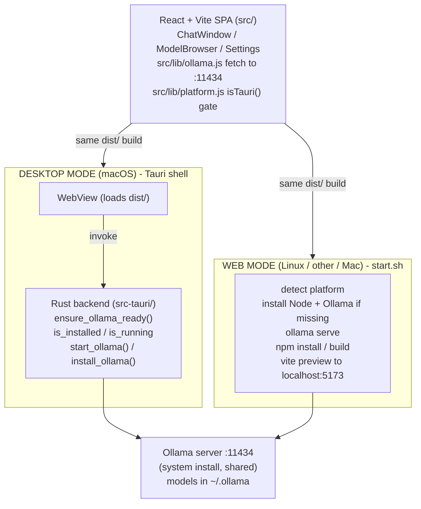
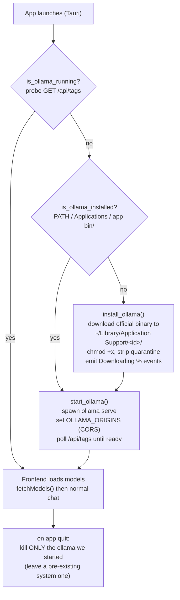

# KRANG to Tauri Desktop + Web-Service Dual-Mode Plan

> Status: planning. Nothing implemented yet. This is the persisted plan from the
> Tauri integration design session.

## Goal
Ship KRANG as a native macOS app (DMG) that auto-manages Ollama, while keeping a
clean web-only mode (`start.sh`) for Linux and other platforms. Both modes build
from the same React/Vite frontend with zero changes to chat logic.

## Codebase findings that shape this plan
- Frontend: React 18 + Vite SPA, no backend. Talks to Ollama via browser `fetch`
  to a hardcoded `http://localhost:11434` (`src/lib/ollama.js:4`).
- Toolchain: Node 25 / npm 11 present; no Rust/Cargo installed (Tauri needs it).
- Web-only bootstrap already largely exists: `start.sh` detects platform,
  installs Node/Ollama if missing, starts `ollama serve`, optionally pulls a
  default model, installs deps, builds, and runs `vite preview` on Linux + Mac.
  The plan refines this rather than tarting from scratch.
- `.gitignore` ignores `node_modules`, `dist`, `.DS_Store`, `*.local`.

## Architecture at a glance
- The React SPA is the single source of truth for UI in both modes.
- Web mode: `vite build` then `vite preview` (or any static host) + browser
  `fetch` to `localhost:11434`. This is what `start.sh` already does.
- Desktop mode: same `dist/` loaded into a Tauri WebView; a Rust backend manages
  Ollama (detect / start / download-install) and the app talks to
  `localhost:11434` exactly as the web app does.
- One frontend codebase, one extra `src-tauri/` folder, conditional behavior
  gated by a runtime check for the Tauri API.

---

## Phase 0 - Prerequisites and decisions (before any code)
- [ ] Install the Rust toolchain (`rustup`, `cargo`) - not currently present.
- [ ] Confirm Tauri 2.x (current; recommended) vs Tauri 1.
- [ ] Resolve the open decisions in the "Decisions needed" section below
      (esp. Ollama acquisition strategy, code signing, and the
      Node-deps-on-first-launch question, which is partly a misconception worth
      correcting).

## Phase 1 - Tauri scaffolding alongside the React app
- [ ] Add dev dependencies: `@tauri-apps/cli`, `@tauri-apps/api` (and plugins:
      `@tauri-apps/plugin-shell`, `-process`, `-http`, `-os`, `-fs` as needed).
- [ ] Create `src-tauri/` with: `Cargo.toml`, `tauri.conf.json`, `build.rs`,
      `src/main.rs`, `src/lib.rs`, `icons/`, `capabilities/`.
- [ ] Configure `tauri.conf.json`:
  - `build.beforeBuildCommand = "npm run build"`,
    `build.beforeDevCommand = "npm run dev"`,
    `build.frontendDist = "../dist"`,
    `build.devUrl = "http://localhost:5173"`.
  - `app.security.csp` allowing `connect-src` to `http://localhost:11434` and
    `ws:` (Vite HMR in dev).
  - `productName`, `identifier` (e.g. `com.krang.localai`), `version` synced from
    `package.json`.
- [ ] Add npm scripts: `"tauri": "tauri"`, `"tauri:dev"`, `"tauri:build"`.
- [ ] Generate app icons (`tauri icon`) from a source PNG (KRANG mark).
- [ ] Add `src-tauri/target/` and `src-tauri/gen/` to `.gitignore`.

## Phase 2 - Repo structure for coexistence
- [ ] Keep the frontend untouched; isolate all desktop logic in `src-tauri/`.
- [ ] Add a small `src/lib/platform.js` helper exposing `isTauri()` (checks
      `window.__TAURI_INTERNALS__`) and a thin wrapper that calls Rust commands
      only when in Tauri, no-ops in the browser.
- [ ] Wire a startup gate in the frontend: in Tauri, before the first
      `fetchModels()`, await an `ensure_ollama_ready` command; in the browser,
      behave exactly as today.
- [ ] Document the two entry points so contributors know `vite`/`start.sh` = web,
      `tauri:*` = desktop.

## Phase 3 - Rust backend (Ollama lifecycle)
- [ ] `is_ollama_running()` -> probe `GET http://localhost:11434/api/tags`;
      return bool.
- [ ] `is_ollama_installed()` -> check PATH for `ollama`, the standard macOS
      install location, and the app's sandboxed `bin/ollama`.
- [ ] `start_ollama()` -> spawn `ollama serve` as a managed child; capture logs;
      set `OLLAMA_ORIGINS` so the Tauri WebView origin is allowed (CORS); poll
      `/api/tags` until ready or timeout.
- [ ] `install_ollama()` -> download the official Ollama binary into the app data
      dir (`~/Library/Application Support/<identifier>/bin/`), `chmod +x`, strip
      macOS quarantine (`xattr -d com.apple.quarantine`), then start it. Stream
      download progress to the frontend via Tauri events.
- [ ] `ensure_ollama_ready()` -> orchestrator: running? -> done. Installed but
      stopped? -> start. Missing? -> download+install+start. Emits status events
      the UI can show ("Starting Ollama...", "Downloading Ollama... 42%").
- [ ] On app exit, terminate any Ollama process we started (mirror the
      `start.sh` cleanup logic - do not kill a pre-existing system Ollama).
- [ ] Register all commands in the Tauri builder; scope capabilities/permissions
      narrowly.

## Phase 4 - First-launch dependency handling
> Note: for a packaged DMG app, the frontend is pre-built and bundled - Node and
> npm are not required at runtime, and there are no npm deps to install on the
> user's machine. See the decision flag below. Concretely this phase is:
- [ ] On first launch, run `ensure_ollama_ready()` with a friendly
      modal/progress UI (reuse the existing `OllamaOfflineError` empty-state
      styling).
- [ ] Persist a "first-run complete" marker in app data dir.
- [ ] (Optional, from-source/dev only) A guarded path that runs `npm install` if
      `dist/` is missing - only meaningful when running unpackaged.

## Phase 5 - DMG build script (macOS)
- [ ] Configure `tauri.conf.json` `bundle.targets = ["dmg", "app"]` and
      `bundle.macOS` (category, minimum system version, optional DMG
      background/layout).
- [ ] Add `scripts/build-mac.sh`: checks for Rust/Xcode CLT, runs
      `npm run build`, then `tauri build` (with `--target
      universal-apple-darwin` if universal chosen), and prints the resulting
      `.dmg` path under `src-tauri/target/.../bundle/dmg/`.
- [ ] No code signing or notarization (decided: ship unsigned). Ensure the
      README documents the one-time right-click then Open Gatekeeper workaround.

## Phase 6 - Web-only startup (Linux / other)
- [ ] Refactor the existing `start.sh` into the canonical web entry point;
      ensure it never references Tauri.
- [ ] Verify it still: detects platform, installs Node/Ollama if missing, starts
      Ollama, optional model pull, `npm install`, `npm run build`,
      `npm run preview`.
- [ ] Add a `--dev` flag (use `vite` dev server instead of build+preview) for
      contributors.

## Phase 7 - README rewrite (two sections)
- [ ] Section A - Mac app (DMG): download/build the DMG, drag to Applications,
      first-launch Ollama auto-setup, Gatekeeper note if unsigned.
- [ ] Section B - Web service (Linux/other): clone, `./start.sh`, open
      `localhost:5173`; manual fallback steps.
- [ ] Keep existing feature docs; add a "Which mode should I use?" intro.

## Phase 8 - Verification
- [ ] `npm run tauri:dev` launches, detects/starts Ollama, chat streams.
- [ ] Clean-machine simulation (move `ollama` aside): app downloads + installs +
      starts it.
- [ ] `./scripts/build-mac.sh` produces a launchable DMG; installed app works
      with Ollama absent.
- [ ] `./start.sh` still works unchanged on web; browser mode untouched.

---

## Decisions (all resolved)
1. Ollama acquisition - DECIDED: (a) prefer system Ollama, download into the
   sandboxed app dir only if missing. No bundled sidecar.
2. Auto-install Node deps on first launch - DECIDED: dropped for the packaged
   app (frontend is pre-bundled; no Node at runtime). Dependency bootstrapping
   stays in `start.sh` for web mode only.
3. Code signing / notarization - DECIDED: ship UNSIGNED (no paid Apple Developer
   ID). Users get a one-time Gatekeeper prompt on first launch and open the app
   via right-click then Open. Phase 5 build script stays simple (no signing /
   notarization steps); the README (Phase 7, Section A) must document the
   right-click-to-open workaround.
4. Universal vs Apple-Silicon-only DMG - DECIDED: Apple Silicon only (arm64).
   Revisit if Intel support is ever needed.
5. Model storage - DECIDED: share the user's existing `~/.ollama` models. No
   isolated per-app model store.
6. App identity - DECIDED: product name "KRANG", bundle identifier
   `com.krang.localai`.
7. Windows - DECIDED: out of scope for now (Mac DMG + web only). Tauri can target
   it later with little frontend change.

---

## Diagrams

### Dual-mode architecture (shared frontend, two shells)

### ensure_ollama_ready() decision flow (desktop, first launch)

